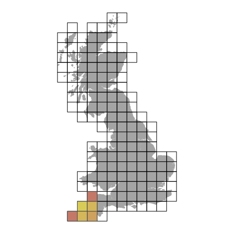

# gisruk 2020
### analysis with spatial weights

This code builds a presentation (and paper) using geographically-weighted regression, with lasso and ridge variants, to reduce prediction error in modelling problems that exhibit strong patterns across space. These techniques, roughly, depress values farther away from an obversation compared to those closer by, leveraging Tobler's law. A complete tutorial will follow.  

